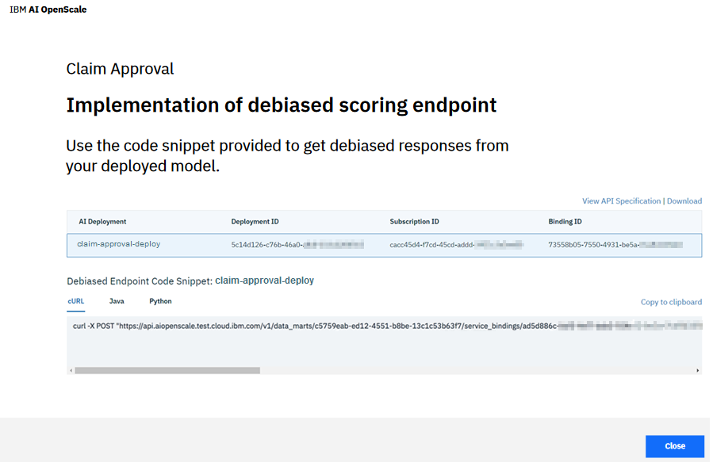

---

copyright:
  years: 2018, 2019
lastupdated: "2019-06-28"

keywords: fairness, monitoring, charts, de-biasing, bias, accuracy

subcollection: ai-openscale

---

{:shortdesc: .shortdesc}
{:external: target="_blank" .external}
{:tip: .tip}
{:important: .important}
{:note: .note}
{:pre: .pre}
{:codeblock: .codeblock}
{:download: .download}
{:screen: .screen}
{:javascript: .ph data-hd-programlang='javascript'}
{:java: .ph data-hd-programlang='java'}
{:python: .ph data-hd-programlang='python'}
{:swift: .ph data-hd-programlang='swift'}
{:faq: data-hd-content-type='faq'}

# De-biasing options
{: #it-dbo}

{{site.data.keyword.aios_short}} uses two types of de-biasing: passive and active. Passive de-biasing lets you know how you were biased, while active de-biasing prevents you from carrying that bias forward by changing the model in real time for the current application.

- *Passive de-biasing* - Passive de-biasing is the work that OpenScale does by itself, automatically, every hour. It is considered passive because it happens without user intervention. When {{site.data.keyword.aios_short}} does bias checking, it also does a de-biasing of the data, by analyzing the behavior of the model, and identifying the data where the model is acting in a biased manner.

  {{site.data.keyword.aios_short}} then builds a machine learning model to predict whether the model is likely to act in a biased manner on a given, new data point. {{site.data.keyword.aios_short}} then analyzes the data which is received by the model, on an hourly basis, and finds the data points where {{site.data.keyword.aios_short}} believes the model is acting in a biased manner. For such data points, the fairness attribute is perturbed from minority to majority, and the perturbed data is sent to the original model for prediction. This prediction of the original model is used as the de-biased output.

  {{site.data.keyword.aios_short}} performs this de-biasing hourly, on all the data which has been received by the model in the past hour. It also computes the fairness for the de-biased output, and displays it in the **De-biased model** tab.

- *Active de-biasing* - Active de-biasing is a way for you to request and bring de-biased results into your application through the REST API endpoint. You are actively directing {{site.data.keyword.aios_short}} to run de-biasing and alter the model so that you can run your application in a non-bias way. In active de-biasing, you can make use of a de-biasing REST API endpoint from your application. This REST API endpoint will internally call your model, and check its behavior.

  If {{site.data.keyword.aios_short}} detects that the model is acting in a biased manner, it perturbs the data as mentioned previously, and sends it back to the original model. The output of the original model on the perturbed data will be returned as the de-biased prediction. If {{site.data.keyword.aios_short}} determines that the original model is not acting in a biased manner, then {{site.data.keyword.aios_short}} will return the original model's prediction as the de-biased prediction. Thus, by using this REST API endpoint, you can ensure that your application does not make decisions based on biased output of your models.

Select the **Debiased Scoring Endpoint** link to find your de-biasing REST API endpoint

## Next steps
{: #it-dbo-nextsteps}

- To mitigate bias, after it has been detected, you must build a new version of the model that fixes the problem. {{site.data.keyword.aios_short}} stores biased records in the manual labelling table. These biased records need to be manually labelled and then the model needs to be retrained using this additional data to build a new version of the model which is unbiased.

