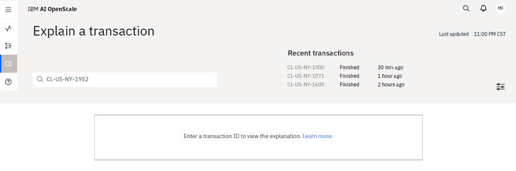

---

copyright:
  years: 2018, 2019
lastupdated: "2019-06-28"

keywords: explainability, monitoring, explain, explaining, transactions, transaction ID

subcollection: ai-openscale

---

{:shortdesc: .shortdesc}
{:external: target="_blank" .external}
{:tip: .tip}
{:important: .important}
{:note: .note}
{:pre: .pre}
{:codeblock: .codeblock}
{:screen: .screen}

# Explaining transactions
{: #ie-ov}

For each deployment, you can see explainability data for specific transactions. Transactions appear only when there is data to support the monitors and is based on the thresholds that you set, the time that monitors are scheduled to run, and availability of payload data from {{site.data.keyword.pm_full}}.
{: shortdesc}

## Viewing explanations by transaction ID
{: #ie-view}

1. Click a deployment tile.
2. Click the **Explain a transaction** tab (  ) in the navigator.
3. Type a transaction ID.

Whenever data is sent to the model for scoring, it sets a transaction ID in the HTTP header by setting the `X-Global-Transaction-Id` field. This transaction ID gets stored in the payload table. To find an explanation of the model behavior for a particular scoring, specify the transaction ID associated with that scoring request. Please note that this behavior applies only to {{site.data.keyword.pm_full}} transactions, and is not applicable for non-WML transactions.
{: note}

## Finding a transaction ID in {{site.data.keyword.aios_short}}
{: #ie-find}

1.  From the time chart for your deployment, slide the marker across the chart and click the **View details** link to [visualize data for a specific hour](/docs/services/ai-openscale?topic=ai-openscale-it-ov#it-vdet).
1.  Click the **View transactions** button to [view the list of transaction IDs](/docs/services/ai-openscale?topic=ai-openscale-it-ov#it-tra).
1.  Copy one of the transaction IDs from the list, paste it into the search box on the **Explain a transaction** page, and press Enter.

    The list of transaction IDs also has the option to simply click the **Explain** link in the Action column for any transaction ID, which will open that transaction in the Explainability tab.
    {: note}

  See the following sections for examples of explanations for different types of models.

  

## Finding explanations through chart details
{: #ie-view-ui}

Because explanations exist for fairness and drift metrics, you can click the charts to get a detailed view of the data set and then either click the **View transactions** button for fairness metrics or click a drift transaction tile to see transaction explanations.

- For one of the fairness attributes, such as sex or age click the attribute, then click the chart, and then click the **View transactions** button.
- For the drift monitor, click **Drift magnitude**, click the chart, and then click a tile to see the transactions associated with that particular drift group.

## Next steps
{: #ie-trans-id-next}

- [Explaining categorical models](/docs/services/ai-openscale?topic=ai-openscale-ie-class)
- [Explaining image models](/docs/services/ai-openscale?topic=ai-openscale-ie-image)
- [Explaining unstructured text models](/docs/services/ai-openscale?topic=ai-openscale-ie-unstruct)
- [Contrastive explanations](/docs/services/ai-openscale?topic=ai-openscale-ie-pp-pn)
