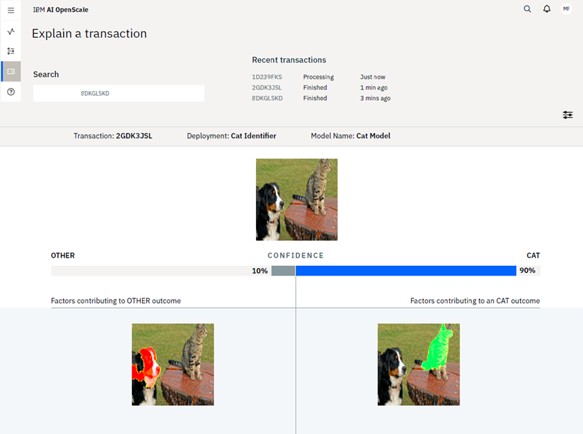

---

copyright:
  years: 2018, 2019
lastupdated: "2019-06-28"

keywords: fairness, monitoring, charts, de-biasing, bias, accuracy

subcollection: ai-openscale

---

{:shortdesc: .shortdesc}
{:external: target="_blank" .external}
{:tip: .tip}
{:important: .important}
{:note: .note}
{:pre: .pre}
{:codeblock: .codeblock}
{:download: .download}
{:screen: .screen}
{:javascript: .ph data-hd-programlang='javascript'}
{:java: .ph data-hd-programlang='java'}
{:python: .ph data-hd-programlang='python'}
{:swift: .ph data-hd-programlang='swift'}
{:faq: data-hd-content-type='faq'}

# Explaining image models
{: #ie-image}

{{site.data.keyword.aios_short}} supports explainability for image data.
{: shortdesc}

## Working with an image model
{: #ie-image-working}

1. Set up your environment.
   2. Install the {{site.data.keyword.aios_short}} and {{site.data.keyword.pm_full}} packages.
   3. Configure your credentials.
   4. Install the libraries that are needed for creating the models and doing analysis. These include the following libraries:
      - `keras`
      - `tensorflow`
      - `keras_sequential_ascii`
      - `numpy`
      - `pillow`

1. Create and deploy your image-based model.
   2. Create folders for the images based on how you classify them.
       - Inside the main `data` directory you must have `train` and `validation` subdirectories.
       - Within each of the subdirectories, you must have your classification directories.
  2. Standardize the image size and then set the subdirectories to be used for training and validation.
  3. Preprocess the data to rescale and retrieve the images and their classes.
  4. Define and train the model.
  5. Store the model.
  6. Deploy the model.

7. Configure {{site.data.keyword.aios_short}} by assigning the `APIClient`, sbuscribing the asset and scoring the model.
8. Configure explainability.
   9. Enable the explainability.
   10. Get explanations for the transactions.
   11. Display the explained images. 

## Explaining image model transactions
{: #ie-image-workingviewing}

For an image classification model example of explainability, you can see which parts of an image contributed positively to the predicted outcome and which contributed negatively. In the following example, the image in the positive pane shows the parts which impacted positively to the prediction and the image in the negative pane shows the parts of images that had a negative impact on the outcome.

For {{site.data.keyword.pm_full}}, scoring input for image classification models that are sent for payload logging cannot exceed 1 MB. To avoid time out issues, images must not exceed 125 x 125 pixels and must be sent sequentially so that the explanation for the second image is requested when the first one is completed.
{: note}

## Image model examples
{: #ie-image-working-ntbks}

Use the following two notebooks to see detailed code samples and develop your own {{site.data.keyword.aios_short}} deployments:

- [Tutorial on generating an explanation for an image-based model](https://github.ibm.com/aiopenscale/explainability/blob/master/public/notebooks/demo/image_explanation.ipynb){: external}
- [Tutorial on generating an explanation for an image-based binary classifier model](https://github.ibm.com/aiopenscale/explainability/blob/master/public/notebooks/demo/image_explanation_binary.ipynb){: external}

