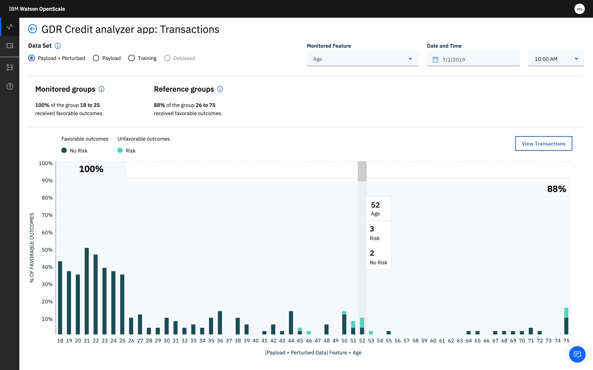

---

copyright:
  years: 2018, 2019
lastupdated: "2019-09-09"

keywords: fairness, monitoring, charts, de-biasing, bias, accuracy

subcollection: ai-openscale

---

{:shortdesc: .shortdesc}
{:external: target="_blank" .external}
{:tip: .tip}
{:important: .important}
{:note: .note}
{:pre: .pre}
{:codeblock: .codeblock}
{:download: .download}
{:screen: .screen}
{:javascript: .ph data-hd-programlang='javascript'}
{:java: .ph data-hd-programlang='java'}
{:python: .ph data-hd-programlang='python'}
{:swift: .ph data-hd-programlang='swift'}
{:faq: data-hd-content-type='faq'}

# Visualizing data for a specific hour
{: #it-vdet}

To see details behind a particular Fairness statistic, click the chart for a specific time. A visualization opens of the data points for a monitored feature at the selected hour. Following the previous example the Age feature is shown in the following example.
{: shortdesc}

Note the three filters at the top of the page (Feature, Date, and Hour) that let you select a different feature or time to review details.

## Interpreting the chart
{: #it-intp}

The chart shows multiple things:

- You can observe the population experiencing bias (customers between 18 and 23 years old). The chart also shows the percentage of expected outcome for this population.

- The chart shows the percentage of expected outcome (70%) for the reference population. This is the average of expected outcome across all reference populations.

- The chart is indicating the presence of bias, because the ratio of percentage of expected outcomes for populations age 18 to 23 years old to the percentage of expected outcomes for the reference population exceeds the threshold. In other words, 0.52/0.7 = 0.74, which is less than the 0.8 threshold.

- The chart also shows the distribution of the reference and monitored values for each distinct value of the attribute in the data from the payload table which was analyzed to identify bias. In other words, if the bias detection algorithm analyzed the last 1790 records from the payload table, then 120 of those records had customer age between 18 and 23, and out of that distribution the `Approved` and `Denied` outcomes are represented by the bar chart. The distribution of the payload data is shown for each distinct value of the fairness attribute (even reference values are shown). This information can be used to correlate the bias with the amount of data received by the model.

- The chart additionally shows that the population with ages between 31 and 35 years received 91% expected outcomes. This signifies the source of the bias, which means that data in this group skewed the results, and led to an increase in the percentage of expected outcomes for the reference class. This information can be used to identify parts of the data which can then be under-sampled when retraining the model.

- Another important thing that the chart shows is the name of the table containing the data which has been identified for manual labeling. Whenever the algorithm detects bias in a model, it also identifies the data points which can be sent for manual labeling by humans. This manually-labeled data can then be used along with the original training data to retrain the model. This retrained model is likely to not have the bias. The manual labeling table is present in the database associated with the {{site.data.keyword.aios_short}} instance.
