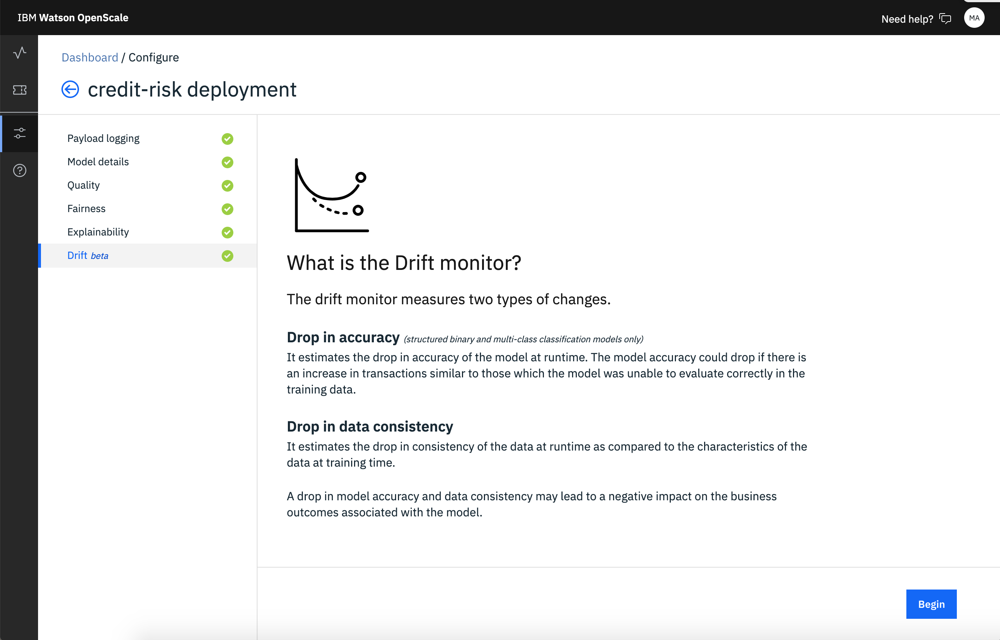

---

copyright:
  years: 2018, 2019
lastupdated: "2019-06-28"

keywords: accuracy, 

subcollection: ai-openscale

---

{:shortdesc: .shortdesc}
{:external: target="_blank" .external}
{:tip: .tip}
{:important: .important}
{:note: .note}
{:pre: .pre}
{:codeblock: .codeblock}
{:download: .download}
{:screen: .screen}
{:javascript: .ph data-hd-programlang='javascript'}
{:java: .ph data-hd-programlang='java'}
{:python: .ph data-hd-programlang='python'}
{:swift: .ph data-hd-programlang='swift'}
{:faq: data-hd-content-type='faq'}

# Configuring the drift detection monitor 
{: #behavior-drift-config}

You must configure the {{site.data.keyword.aios_full}} drift monitor before it can begin to analyze your model. There are two options, either training your model online or using a notebook.
{: shortdesc}

You can train your model online by using {{site.data.keyword.aios_short}}
if you use {{site.data.keyword.pm_full}} and your data does not exceed 500 MB. Otherwise, you must use a notebook to train the model.

## Steps to configure drift in {{site.data.keyword.aios_short}}
{: #behavior-drift-config-steps-wos}

If you use {{site.data.keyword.pm_full}}, you have the option of using the {{site.data.keyword.aios_short}} user interface to configure drift detection.

1. From the **Drift** tab, on the **What is Drift**? page, click **Begin** to start the configuration process.

   

2. Click the **Train in Watson OpenScale** tile.

   

3. Set the alert threshold.

   

3. Set the sample size.

   
   
3. Click **Save**.

## Steps to configure drift using a notebook
{: #behavior-drift-config-steps-ntbk}

If you use a machine learning provider other than {{site.data.keyword.pm_full}}, such as Microsoft Azure, Amazon SageMaker, or a custom machine learning engine you must use a notebook to configure drift detection. It is possible to configure drift for {{site.data.keyword.pm_full}} by using this method, as well.

This option is useful if the training data is not stored in Db2 or {{site.data.keyword.cos_full}}. Using a notebook, you must read the training data into a dataframe. The specialized notebook that you can download from {{site.data.keyword.aios_short}} then creates a specialized output that you can upload to {{site.data.keyword.aios_short}}.

1. Create a notebook to generate the drift detection model. Use [the sample notebook](https://github.com/IBM-Watson/aios-data-distribution/blob/master/training_statistics_notebook.ipynb) that is available from the {{site.data.keyword.aios_short}} UI.
2. Use compression software to compress the drift detection model into a .tar.gz file.

1. From the **Drift** tab, on the **What is Drift**? page, click **Begin** to start the configuration process.

   

2. Click the **Train in a notebook** tile.

   

3. Drag the compressed model file into the target zone, or browse to select it and click **Next**.

   
   
3. Upload the drift detection model and click **Next**.

   
   
3. Set the alert threshold.

   

3. Set the sample size.

   
   
3. Click **Save**.

## Next steps
{: #behavior-drift-config-next-steps}

- For more information about interpreting drift, see [Drift magnitude](/docs/services/ai-openscale?topic=ai-openscale-behavior-drift-ovr)