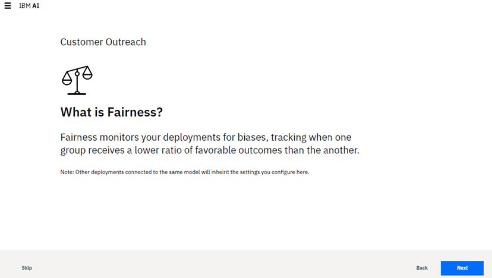

---

copyright:
  years: 2018, 2019
lastupdated: "2019-09-09"

keywords: fairness, fairness monitor, payload, perturbation, training data, debiased

subcollection: ai-openscale

---

{:shortdesc: .shortdesc}
{:external: target="_blank" .external}
{:tip: .tip}
{:important: .important}
{:note: .note}
{:pre: .pre}
{:codeblock: .codeblock}
{:download: .download}
{:screen: .screen}
{:javascript: .ph data-hd-programlang='javascript'}
{:java: .ph data-hd-programlang='java'}
{:python: .ph data-hd-programlang='python'}
{:swift: .ph data-hd-programlang='swift'}
{:faq: data-hd-content-type='faq'}

# Configuring the fairness monitor
{: #mf-monitor}

In {{site.data.keyword.aios_full}}, the fairness monitor scans your deployment for biases, to ensure fair outcomes across different populations.
{: shortdesc}

## Requirements
{: #mf-monitor-reqs}

Throughout this process, {{site.data.keyword.aios_full}} analyzes your model and makes recommendations based on the most logical outcome. On the successive pages of the **Fairness** tab, you must provide the following information:

### Values that represent a favorable outcome for the model
{: #mf-monitor-reqs-fave}

Values are derived from the `label` column in the [training data](/docs/services/ai-openscale?topic=ai-openscale-trainingdata#trainingdata), if the model output schema contains a mapping column. In {{site.data.keyword.pm_full}}, the `prediction` column always has a double value. The mapping column is used to specify the mapping of this `prediction` value to the class label.

For example, if the `prediction` value is `1.0`, the mapping column could have a value of `Loan denied`; this implies that the prediction of the model is `Loan denied`. So, if the model output schema contains a mapping column, then specify Favorable and Unfavorable values using those present in the mapping column.

If, however, the mapping column is not present in the model output schema, then the Favorable and Unfavorable values need to be specified using the value of the `prediction` column (`0.0`, `1.0`, etc.)

### Features to monitor
{: #mf-monitor-reqs-feats}

Only features which are of categorical, numeric (integer), float, or double fairness data type are supported. Features with other data types are not supported. For each of the features, you must configure the following values:

#### Reference and monitored groups
{: #mf-monitor-reqs-refandmon}

Each feature has specific requirements to configure. For example, if you choose `age` as one of your monitored features, you must define the age ranges for a **Reference Group** and a **Monitored Group** by entering values directly in each group.

#### Fairness alert threshold for the feature
{: #mf-monitor-reqs-thresh}

A Fairness threshold is used to specify an acceptable difference between the percentage of Favorable outcomes for the Monitored group as compared to the percentage of Favorable outcomes for the Reference group.

Consider a model that predicts who should get a loan (`favorable outcome=loan granted`) and who shouldn’t (`unfavorable outcome=loan denied`). Further, the Monitored value for age is `[18,25]`, and the Reference value is `[26,100]`. When the bias detection algorithm runs, if it finds that the percentage of Favorable outcomes for people in the age group `[18,25]` in the last `N` records plus perturbed data is `50%`, while the percentage of Favorable outcomes for people in the age group `[26,100]` is `70%`, then Fairness is computed as 50*100/70 = 71.42.

If the Fairness threshold is set to 80%, then the algorithm will flag the model as being biased, because the computed Fairness exceeds the threshold. However, if the threshold is set to 70% then it will not report the model as being biased.

The values that you enter in these screens should be those that are sent to the model scoring endpoint (and consequently will be added to the payload table). If the data is being manipulated before sending to the scoring endpoint, then enter the manipulated values. For example, if the original data had values of `Male` and `Female` for *Gender* and it was manipulated so that the data sent to the scoring endpoint was `M` and `F`, then enter `M` and `F` on this screen.

### Minimum sample size
{: #mf-monitor-reqs-min}

By setting a minimum sample size, you prevent measuring fairness until a minimum number of records are available in the evaluation dataset. This ensures the sample size is not too small to skew results. Every time bias checking runs, it will use the minimum sample size to decide the number of records on which it will do the bias computation.

## Steps
{: #mf-config}

To start the configuration process, from the **Fairness** tab, on the **What is the Fairness monitor?** page, click **Begin**.

Follow the prompts and enter required information. When you finish, a summary of your selections is presented for review. If you want to change anything, click the **Edit** link for that section, otherwise, save your work.

You can also click **Add another feature** to return to the feature selection screen and add more features, such as `City`, `Zip Code` or `Account Balance` to the Fairness monitor.

### Understanding how de-biasing works
{: #mf-debias}

To check the debias endpoint, click the **Debias Endpoint** button. You can then view and copy the enpoint in different formats, such as cURL, Java, or Python. 

The de-biased scoring endpoint can be used exactly as the normal scoring endpoint of your deployed model. In addition to returning the response of your deployed model, it also returns the `debiased_prediction` and `debiased_probability` columns.

- The `debiased_prediction` column contains the debiased prediction value. In the case of {{site.data.keyword.pm_full}}, this is an encoded representation of the prediction. For example, if the model prediction is either "Loan Granted" or "Loan Denied", {{site.data.keyword.pm_full}} can encode these two values to "0.0" and "1.0", respectively. The `debiased_prediction` column contains such an encoded representation of the debiased prediction.

- The `debiased_probability` column, on the other hand, represents the probability of the debiased prediction. This is an array of double value, where each value represents the probability of the de-biased prediction belonging to one of the prediction classes.

One another column, `debiased_decoded_target`, is also returned, in case you have a column in your output schema that contains a column with `modeling-role` as `decoded-target`.

- The `debiased_decoded_target` column contains the string representation of the debiased prediction. In the previous example, where the prediction value was either "0.0" or "1.0", the `debiased_decoded_target` will contain either "Loan Granted" or "Loan Denied".

Ideally, you would directly call this endpoint from your production application, instead of directly calling the scoring endpoint of your model deployed in your model serve engine ({{site.data.keyword.pm_full}}, Amazon Sagemaker, Microsoft Azure ML Studio, etc.) This way, {{site.data.keyword.aios_short}} will also store the `debiased` values in the payload logging table of your model deployment. Then, all scoring done via this endpoint would be automatically de-biased.

Because this endpoint deals with runtime bias, it will continue to run background checks for the latest scoring data from the payload logging table, and keep updating the bias mitigation model which is used to de-bias the scoring requests sent. In this way, {{site.data.keyword.aios_short}} is always up-to-date with the latest incoming data, and with its behavior to detect and mitigate bias.

Finally, {{site.data.keyword.aios_short}} uses a threshold to decide that data is now acceptable and is deemed to be unbiased. That threshold is taken as the least value from the thresholds set in the Fairness monitor for all the fairness attributes configured.

## Next steps
{: #mf-next}

To continue configuring monitors, click the **Drift** tab and click **Begin**. For more information, see [Configuring the drift detection monitor](/docs/services/ai-openscale?topic=ai-openscale-behavior-drift-config).
