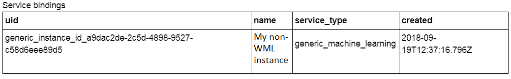

---

copyright:
  years: 2018, 2019
lastupdated: "2019-06-28"

keywords: payload, non-Watson, machine learning, services, subscription

subcollection: ai-openscale

---

{:shortdesc: .shortdesc}
{:external: target="_blank" .external}
{:tip: .tip}
{:important: .important}
{:note: .note}
{:pre: .pre}
{:codeblock: .codeblock}
{:download: .download}
{:screen: .screen}
{:javascript: .ph data-hd-programlang='javascript'}
{:java: .ph data-hd-programlang='java'}
{:python: .ph data-hd-programlang='python'}
{:swift: .ph data-hd-programlang='swift'}
{:faq: data-hd-content-type='faq'}

# Payload logging with the Custom machine learning engine
{: #cml-cusconfig}

## Bind your Custom machine learning engine
{: #cml-cusbind}

- A non-{{site.data.keyword.pm_full}} engine is bound as Custom, meaning that this is just metadata; there is no direct integration with the non-{{site.data.keyword.pm_full}} service. You can bind more than one machine learning engine to {{site.data.keyword.aios_short}} by using the `client.data_mart.bindings.add` method.

    ```python
    custom_engine_credentials = {
    "url": "***",
    "username": "***",
    "password": "***"
    }

    binding_uid = client.data_mart.bindings.add('My custom engine', CustomMachineLearningInstance(custom_engine_credentials))

    bindings_details = client.data_mart.bindings.get_details()
    ```
  You can see your service binding with the following command:

    ```python
    client.data_mart.bindings.list()
    ```

    

## Add Custom subscription
{: #cml-cussub}

- Add subscription

    ```python
    client.data_mart.subscriptions.add(CustomMachineLearningAsset(source_uid='action', binding_uid=binding_uid, prediction_column='predictedActionLabel'))
    ```

- Get subscription list

    ```python
    subscriptions = client.data_mart.subscriptions.get_details()

    subscriptions_uids = client.data_mart.subscriptions.get_uids()
    print(subscriptions_uids)
    ```

## Enable payload logging
{: #cml-cusenlog}

- Enable payload logging in subscription

    ```python
    subscription.payload_logging.enable()
    ```

- Get logging details

    ```python
    subscription.payload_logging.get_details()
    ```

For more information, see [Payload logging]().

## Scoring and payload logging
{: #cml-cusscore}

- Score your model. For a full example, see the [IBM {{site.data.keyword.aios_full}} & Custom ML engine notebook](https://github.com/pmservice/ai-openscale-tutorials/blob/master/notebooks/AI%20OpenScale%20and%20Custom%20ML%20Engine.ipynb){: external}.

- Store the request and response in the payload logging table

    ```python
    records_list = [PayloadRecord(request=request_data, response=response_data, response_time=response_time), PayloadRecord(request=request_data, response=response_data, response_time=response_time)]

    subscription.payload_logging.store(records=records_list)
    ```
    **Note**: For languages other than Python, you can also perform payload logging directly, using a REST API.

    ```json
    token_endpoint = "https://iam.cloud.ibm.com/identity/token"
    headers = {
            "Content-Type": "application/x-www-form-urlencoded",
            "Accept": "application/json"
    }

    data = {
            "grant_type":"urn:ibm:params:oauth:grant-type:apikey",
            "apikey":aios_credentials["apikey"]
    }

    req = requests.post(token_endpoint, data=data, headers=headers)
    token = req.json()['access_token']
    ```

    ```json
    import requests, uuid

    PAYLOAD_STORING_HREF_PATTERN = '{}/v1/data_marts/{}/scoring_payloads'
    endpoint = PAYLOAD_STORING_HREF_PATTERN.format(aios_credentials['url'], aios_credentials['data_mart_id'])

    payload = [{
      'binding_id': binding_uid,
      'deployment_id': subscription.get_details()['entity']['deployments'][0]['deployment_id'],
      'subscription_id': subscription.uid,
      'scoring_id': str(uuid.uuid4()),
      'response': response_data,
      'request': request_data
    }]

    headers = {"Authorization": "Bearer " + token}
    req_response = requests.post(endpoint, json=payload, headers = headers)
    print("Request OK: " + str(req_response.ok))
    ```

