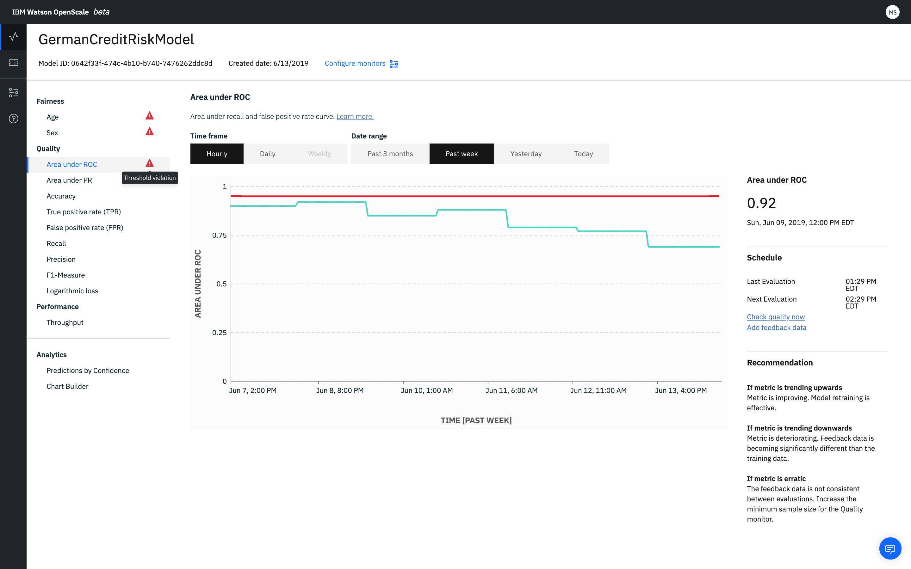

---

copyright:
  years: 2018, 2019
lastupdated: "2019-06-28"

keywords: metrics, monitoring, custom metrics, thresholds, Area under ROC

subcollection: ai-openscale

---

{:shortdesc: .shortdesc}
{:external: target="_blank" .external}
{:tip: .tip}
{:important: .important}
{:note: .note}
{:pre: .pre}
{:codeblock: .codeblock}
{:download: .download}
{:screen: .screen}
{:javascript: .ph data-hd-programlang='javascript'}
{:java: .ph data-hd-programlang='java'}
{:python: .ph data-hd-programlang='python'}
{:swift: .ph data-hd-programlang='swift'}
{:faq: data-hd-content-type='faq'}

# Area under ROC 
{: #quality_roc}

Area under receiver operating characteristic curve gives the area under recall and false positive rate curve. It calculates the sensitivity against the fallout rate.
{: shortdesc}

## Area under ROC at a glance
{: #quality_roc-glance}

- **Description**: Area under recall and false positive rate curve
- **Default thresholds**: Lower limit = 80%
- **Default recommendation**:
   - **Upward trend**: An upward trend indicates that the metric is improving. This means that model retraining is effective.
   - **Downward trend**: A downward trend indicates that the metric is deteriorating. Feedback data is becoming significantly different than the training data.
   - **Erratic or irregular variation**: An erratic or irregular variation indicates that the feedback data is not consistent between evaluations. Increase the minimum sample size for the Quality monitor.
- **Problem type**: Binary classification
- **Chart values**: Last value in the time frame
- **Metrics details available**: Confusion matrix

## Interpreting the display
{: #quality_roc-display}

## Do the math
{: #quality_roc-math}

The Area under ROC is plotted parametrically as the `True positive rate` versus the `False positive rate` withe respect to a threshold `T`.

