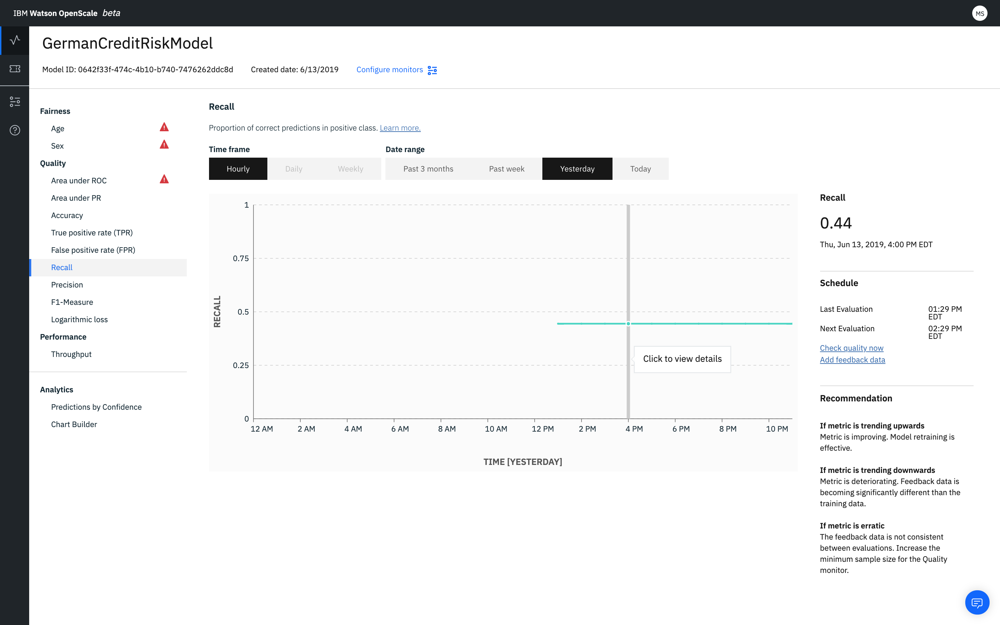

---

copyright:
  years: 2018, 2019
lastupdated: "2019-09-09"

keywords: metrics, monitoring, custom metrics, thresholds

subcollection: ai-openscale

---

{:shortdesc: .shortdesc}
{:external: target="_blank" .external}
{:tip: .tip}
{:important: .important}
{:note: .note}
{:pre: .pre}
{:codeblock: .codeblock}
{:download: .download}
{:screen: .screen}
{:javascript: .ph data-hd-programlang='javascript'}
{:java: .ph data-hd-programlang='java'}
{:python: .ph data-hd-programlang='python'}
{:swift: .ph data-hd-programlang='swift'}
{:faq: data-hd-content-type='faq'}

# Recall
{: #quality_recall}

Recall gives the proportion of correct predictions in positive class.
{: shortdesc}

## Recall at a glance
{: #quality_recall-glance}

- **Description**: Proportion of correct predictions in positive class
- **Default thresholds**: Lower limit = 80%
- **Default recommendation**:
   - **Upward trend**: An upward trend indicates that the metric is improving. This means that model retraining is effective.
   - **Downward trend**: A downward trend indicates that the metric is deteriorating. Feedback data is becoming significantly different than the training data.
   - **Erratic or irregular variation**: An erratic or irregular variation indicates that the feedback data is not consistent between evaluations. Increase the minimum sample size for the Quality monitor.
- **Problem type**: Binary classification
- **Chart values**: Last value in the time frame
- **Metrics details available**: Confusion matrix

## Interpreting the recall metric display
{: #quality_recall-display}



### Fairness score
{: #quality_recall-display-fairness-score}

For the recall metric, the following fairness score is displayed. 


### Schedule
{: #quality_recall-display-schedule}

The **Schedule** pane shows the **Last evaluation** and **Next evaluation** times. Quality metrics are evaluated every hour. You can force evaluation by clicking **Check quality now**. You can also add feedback by clicking **Add feedback data**.


### Recommendation
{: #quality_recall-display-recommendations}

To help you interpret the chart, the **Recommendation** pane displays which trends indicate improving or deteriorating model effectiveness.


## Do the math
{: #quality_recall-math}

Recall (R) is defined as the number of true positives (Tp) over the number of true positives plus the number of false negatives (Fn).

```
                       number of true positives
Recall =   ______________________________________________________

           (number of true positives + number of false negatives)
```
