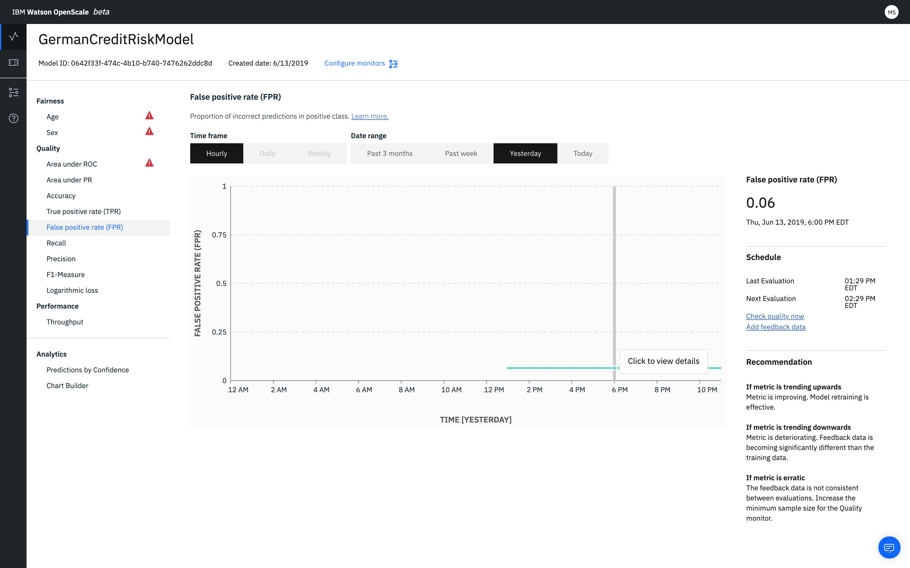

---

copyright:
  years: 2018, 2019
lastupdated: "2019-09-09"

keywords: metrics, monitoring, custom metrics, thresholds, Weighted False Positive Rate, wFPR

subcollection: ai-openscale

---

{:shortdesc: .shortdesc}
{:external: target="_blank" .external}
{:tip: .tip}
{:important: .important}
{:note: .note}
{:pre: .pre}
{:codeblock: .codeblock}
{:download: .download}
{:screen: .screen}
{:javascript: .ph data-hd-programlang='javascript'}
{:java: .ph data-hd-programlang='java'}
{:python: .ph data-hd-programlang='python'}
{:swift: .ph data-hd-programlang='swift'}
{:faq: data-hd-content-type='faq'}

# Weighted False Positive Rate (wFPR)
{: #quality_wfpr_weighted}

The Weighted False Positive Rate (wFPR) gives the weighted mean of class False Positive Rate (FPR) with weights equal to class probability.
{: shortdesc}

## Weighted False Positive Rate (wFPR) at a glance
{: #quality_wfpr_weighted-glance}

- **Description**: Proportion of incorrect predictions in positive class
- **Default thresholds**: Lower limit = 80%
- **Default recommendation**:
   - **Upward trend**: An upward trend indicates that the metric is deteriorating. Feedback data is becoming significantly different than the training data.
   - **Downward trend**: A downward trend indicates that the metric is improving. This means that model retraining is effective.
   - **Erratic or irregular variation**: An erratic or irregular variation indicates that the feedback data is not consistent between evaluations. Increase the minimum sample size for the Quality monitor.
- **Problem type**: Multiclass classification
- **Chart values**: Last value in the time frame
- **Metrics details available**: Confusion matrix

## Interpreting the display
{: #quality_wfpr_weighted-display}



## Do the math
{: #quality_wfpr_weighted-math}

The Weighted False Positive Rate is the application of the FPR with weighted data.

```
                   number of false positives
FPR =  ______________________________________________________

       (number of false positives + number of true negatives)
```